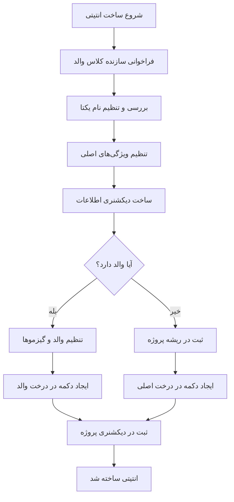

# Entity_creator.py

## <p dir="rtl">مستندات فایل Entity_creator.py</p>

<p dir="rtl">
در این فایل مجموعه‌ای از کلاس‌ها و ابزارهای کمکی جهت ساخت، مدیریت، و ویرایش <strong>Entity</strong>‌ها در موتور <strong>Ursina</strong> تعریف شده‌اند.
این فایل یکی از بخش‌های اصلی سیستم ساخت آبجکت‌ها در محیط ادیتور است و امکاناتی مانند انتخاب رنگ، ساخت پنل‌ها، مدیریت منوها، اجرای فایل‌ها، ورودی‌های عددی، مدیریت اسکریپت‌های موجود روی Entity، مرتب‌سازی منوها، و ورودی‌های اسکرول‌شونده را فراهم می‌کند.
</p>

<p dir="rtl">
این فایل با استفاده از کلاس‌ها و ابزارهای مختلف، یک سیستم کامل برای ایجاد و مدیریت Entityها در محیط گرافیکی فراهم می‌کند.
در ادامه بخش‌های مختلف این فایل را بررسی می‌کنیم.
</p>

## <p dir="rtl">ایمپورت‌ها و وابستگی‌ها</p>

```python
from ursina import *
from .UI_classes import ColorPicker
from .UI_classes import PanelManager , menu_creator , execute_file_module , desimal_inputfield , custom_fd , file_editor , Entity_scripts_args_manager , Sort_menus , catch_menus , ScrollableInputField
from ursina.prefabs.dropdown_menu import DropdownMenu, DropdownMenuButton
from .tree_button import entity_buttons
from .tree_projects_entity import rename_key_in_tree
from AppData import ProjectData
from .File_browser import Browser
from Creator_methods.deselect import deselect_camera_entities
import copy , json , easygui , shutil
```

<p dir="rtl">
در ابتدای فایل، مجموعه‌ای از کلاس‌ها و ابزارهای کمکی از ماژول <code>UI_classes</code> ایمپورت شده‌اند. این کلاس‌ها هرکدام وظیفه‌ای مشخص دارند:
</p>

<ul dir="rtl">
<li><strong>ColorPicker</strong> : انتخاب رنگ برای Entity</li>
<li><strong>PanelManager</strong> : مدیریت پنل‌های گرافیکی</li>
<li><strong>menu_creator</strong> : ساخت منوهای پویا</li>
<li><strong>execute_file_module</strong> : اجرای فایل‌های اسکریپت</li>
<li><strong>desimal_inputfield</strong> : ورودی عددی با پشتیبانی از اعشار</li>
<li><strong>custom_fd</strong> : مدیریت فایل‌ها و مسیرها</li>
<li><strong>file_editor</strong> : ویرایشگر فایل داخلی</li>
<li><strong>Entity_scripts_args_manager</strong> : مدیریت آرگومان‌های اسکریپت‌های متصل به Entity</li>
<li><strong>Sort_menus</strong> : مرتب‌سازی منوها</li>
<li><strong>catch_menus</strong> : گرفتن و مدیریت منوهای فعال</li>
<li><strong>ScrollableInputField</strong> : ورودی اسکرول‌شونده برای متن‌های طولانی</li>
</ul>

<p dir="rtl">
این ابزارها در کنار هم یک سیستم کامل برای ساخت و مدیریت Entityها ایجاد می‌کنند.
</p>

---

## <p dir="rtl">تعریف کلاس entity_tools</p>

<p dir="rtl">
با استفاده از این کلاس انتیتی را ایجاد میکنیم که خاصیت های زیر را دارا است :
    <ul dir="rtl">
        <li>پنل اینسئکتور</li>
        <li>گیزمو های تغییر دهنده مقعیت</li>
        <li>منویی جحت افزودن انتیتی فرزند</li>
        <li>Select و Deselect کردن</li>
    </ul>
</p>

<p dir="rtl"><strong>بررسی سازنده کلاس entity_tools :</strong></p>

```python
class entity_tools(Entity):
    # متغیر کلاس برای نگهداری Entity انتخاب شده
    selected_entity = None
    def __init__(self, add_to_scene_entities=True, enabled=True , **kwargs):
        super().__init__(add_to_scene_entities, enabled , **kwargs)
        self.inspector = PanelManager()
        
        self.is_set_parent = False
        # متغیرهای وضعیت انتخاب
        self.is_selected = False
        
        # ایجاد گروه گیزموها
        self.group_gismo = Entity()
        self.group_gismo.position = self.position
```

<p dir="rtl">
متغیر selected_entity در سطح کلاس تعریف شده و انتیتی را که در صحنه انتخاب شده است، نگهداری می‌کند. وقتی یک انتیتی جدید انتخاب می‌شود، این متغیر به‌روزرسانی شده و انتیتی قبلی به‌طور خودکار لغو انتخاب می‌شود. <br>
شی <code>self.inspector</code> از کلاس PanelManager تعریف شده است تا با استفاده از آن برای انتیتی یک پنل اینسکتور جهت تنطیم ویژگی های انتیتی ایجاد کنیم. ویژگی هایی مثل position , rotation , scale , color , texture , script 
</p>

<p dir="rtl">
متغیر های self.is_set_parent و self.is_selected به ترتیب جهت برسی اختصاص دادن parent و انتخاب شدن تعریف شدند.
</p>

```python
# ایجاد گیزموها
        self.x_gis = Entity(
            model='cube', 
            scale=Vec3(10, 0.1, 0.1), 
            color=color.red,
            parent=self.group_gismo
        )
        self.y_gis = Entity(
            model='cube', 
            scale=Vec3(0.1, 10, 0.1), 
            color=color.green,
            parent=self.group_gismo
        )
        self.z_gis = Entity(
            model='cube', 
            scale=Vec3(0.1, 0.1, 10), 
            color=color.blue,
            parent=self.group_gismo
        )
        
        # اضافه کردن collider به گیزموها
        self.x_gis.collider = 'box'
        self.y_gis.collider = 'box'
        self.z_gis.collider = 'box'
        
        # مخفی کردن گیزموها در ابتدا
        self.group_gismo.enabled = False

        .
        .
        .

        # اتصال رویدادهای کلیک روی گیزموها
        self.x_gis.on_click = self.start_drag_x
        self.y_gis.on_click = self.start_drag_y
        self.z_gis.on_click = self.start_drag_z
```

<p dir="rtl">
انتیتی های محور های x , y و z را تعریف کرده و آنها را فرزند انتیتی self.group_gismo قرار دادیم تا بتوانیم بر روی همه آنها کنترل یکباره ای داشته باشیم.<br>
در ادامه , به هر یک کلایدری اختصاص دادیم. در ابتدای ایجاد انتیتی آنها را مخفی کرده ایم. سپس رویداد های اتصالی را به هر یک اختصاص دادیم. این رویداد ها توابعی هستند که با استفاده از آنها انتیتی را در محور مربوطه حرکت میدهیم.
</p>

```python
# متغیرهای وضعیت درگ
        self.is_dragging = False
        self.drag_axis = None
        self.last_mouse_position = None
```

<p dir="rtl">
 این متغیرها برای مدیریت حالت کشیدن انتیتی با ماوس استفاده می‌شوند:<br>
  - <code>is_dragging</code>: مشخص می‌کند که آیا کاربر در حال کشیدن انتیتی است یا خیر.<br> 
  - <code>drag_axis</code>: محوری که انتیتی در آن کشیده می‌شود ('x'، 'y' یا 'z').<br>
   - <code>last_mouse_position</code>: آخرین موقعیت ثبت‌شده ماوس برای محاسبه مقدار جابه‌جایی. 
 </p>


```python
# ایجاد جسم اصلی (خود Entity)
        self.model = 'cube'
        self.color = color.white
        self.scale = 0.5
        self.collider = 'box'  # برای تشخیص کلیک روی خود Entity
```

<p dir="rtl">
ویژگی های پیشفرض هر انتیتی را تنظیم کردیم.
</p>

```python
# اتصال رویداد کلیک روی خود Entity
        self.on_click = self.toggle_selection
        self.menu_childs = menu_creator()
        self.menu_childs_list = self.menu_childs.create_menus('Menus/3_Entity', parent = self)
        self.menu_childs_list.append(DropdownMenuButton(text='Destroy' , on_click = self.destroy_WinPanel))
        self.hide_menu_childe()
        self.menu_childs.vertical_sort(menus=self.menu_childs_list , do_sort_submenus=True)
```

<p dir="rtl">
تابع toggle_selection را به عنوان رویداد کلیک انتیتی تعریف کردیم. یعنی درصورتی که بر روی این انتیتی کلیک شود تابع toggle_selection فراخوانی و اجرا میشود.<br>
شی self.menu_childs از کلاس self.menu_childs تعریف کردیم تا با استفاده از آن منویی عمودی جهت افزودن فرزند به این انتیتی ایجاد کنیم. در ادامه با استفاده از همین شی منو انتیتی ها را به صورت یک لیست دریافت و در متغیر self.menu_childs_list ذخیره کردیم.
سپس به لیست self.menu_childs_list , یک منوباتن با نام Destroy افزودیم تا با استفاده از آن انتیتی ایجاد شده را از صحنه حذف کنیم.<br>
در ادامه تابع self.hide_menu_childe() فراخوانی کردیم تا در ابتدای ایجاد انتیتی , این متو ها مخفی شوند. 
در انتها با استفاده از متود vertical_sort منو ها را به صورت عمودی مرتب کردیم.
</p>

```python
        self.destroy_window = None
        self.select_button = None

        self.details_entity = None
```

<p dir="rtl">
self.destroy_window یک WindowPanel جهت حذف انتیتی خواهد بود. <br>
self.select_button یک Button خواهد بود که به tree_button افزوده خواهد شد و با کلیک آن میتوانیم انتیتی خود را Select یا Deselect کنیم. <br>
self.details_entity یک دیکشنری خواهد بود که ویژگی های انتیتی را در آن ذخیره خواهیم کرد.
</p>

```python
    def destroy_WinPanel(self):
        self.destroy_window = WindowPanel(title = 'Destroy entity', content=(
            Text(f'Are you sure to destroy {self.name} entity') ,
            Button(text='Destroy') ,
            Button(text='Cancel')
        ))
        self.destroy_window.y = self.destroy_window.panel.scale_y / 2 * self.destroy_window.scale_y    # center the window panel
        self.destroy_window.layout()
        self.destroy_window.content[-1].on_click = lambda : destroy(self.destroy_window)
        self.destroy_window.content[-2].on_click = self.destroy_entity
```

<p dir="rtl">
این تابع یک WindowPanel میسازد که از کاربر میپرسد آیا از حذف انتیتی مطمعن هست یا خیر. در صورت تایید کاربر , انتیتی را حذف میکند.
</p>

```python
    def destroy_entity(self):
        ProjectData.remove_entity(self.name)
        destroy(self)
        destroy(self.group_gismo)
        self.inspector.destroy_panels()
        destroy(self.destroy_window)
        self.menu_childs.destroy_menus(self.menu_childs_list)
        if self.select_button:
            self.select_button.remove()
        get_win_panel = [win_panel for win_panel in scene.entities if type(win_panel) is WindowPanel]
        for win_panel in get_win_panel:
            print(f"Removing {win_panel.name}")
            destroy(win_panel)
```

<p dir="rtl">
این تابع جهت حذف تمامی انتیتی هایی که زیر مجموعه انتیتی ایجاد شده هستند تعریف شده است. این انتیتی ها شامل موارد زیر میشوند :
    <ul dir="rtl">
        <li>حذف کلید انتیتی و مقادیر آن از دیکشنری صحنه.</li>
        <li>خود انتیتی</li>
        <li>گیزمو ها</li>
        <li>پنل اینسپکتور انتیتی و زیرمجموعه های آن</li>
        <li>پنل حذف انتیتی (destroy_window)</li>
        <li>منو عمودی ایجاد فرزندان (menu_childs)</li>
        <li>select_button</li>
        <li>هرگونه WindowPanel که توسط این انتیتی ایجاد شده است</li>
    </ul>
</p>


```python
    def set_name(self):
        try:
            entity_name = self.inspector.get_widget_value(
                Panel_name = 'name' , 
                widget_name = 'name_field' , 
                widget_class = InputField ,
                attr='text')
            entity_name = entity_name if entity_name not in ProjectData.data["__names__"] else f"New_{entity_name}"
            current_name = self.name
            self.name = entity_name
            self.select_button.button.text = self.name
            ProjectData.rename_key(current_name , self.name)
            print(f'Name ==> {self.name}')
        except Exception as e:
            pass
```
<p dir="rtl">
تابع رویداد set_name جهت تنظیم نام انتیتی تعریف شده است.<br>
درصورتی که انتیتی در صحنه با نام انتخواب شده وجود نداشته باشد نام انتخاب شده را به انتیتی اختصاص میدهد. درغیر این صورت به ابتدای نام وارد شده یک New_ اضافه میکند و به انتیتی اختصاص میدهد.<br>
قبل از تغییر نام انتیتی , نام فعلی آنرا ذخیره میکند. در انتها نام انتیتی را در دیکشتری صحنه تغییر نام میدهد.
</p>

```python
    def set_color(self):
        try:
            self.color = self.inspector.get_widget_value(
                Panel_name = 'Color' , 
                widget_name = 'color_value' , 
                widget_class = ColorPicker ,
                attr='value')
            ProjectData.set_value(self.name , "color" , tuple(self.color))
            print(f'Color : {self.color}')
        except Exception as e:
            pass
```
<p dir="rtl">
تابع رویداد set_color جهت تنطیم رنگ انتیتی تعریف شده است.
</p>

### <p dir="rtl"> توابع رویداد های تنظیم اندازه انتیتی </p>
<p dir="rtl">
این توابع شامل set_scale_x , set_scale_y و set_scale_z میشود.
این تغییر اندازه به صورت زیر صورت میگیرد :
</p> 

```python
    def set_scale_[x/y/z](self):
        try:
            self.scale_[x/y/z] = self.inspector.get_widget_value(
                Panel_name = 'Scale' , 
                widget_name = 'Scale_[x/y/z]' , 
                widget_class = desimal_inputfield ,
                attr='value')
            ProjectData.set_value(self.name , "scale" , tuple(self.scale))
            print(f'scale [x/y/z] seted : {self.scale_[x/y/z]}')
        except Exception as e:
            pass
```

<p dir="rtl">
این تابع مقدار عددی مربوط به هر محور را از فیلد ورودی پنل اینسپکتور دریافت می‌کند. پس از تأیید، آن مقدار را به ویژگی متناظر انتیتی (scale_x، scale_y یا scale_z) اختصاص می‌دهد و سپس داده‌های به‌روزشده را در دیکشنری صحنه ذخیره می‌کند.
</p> 

### <p dir="rtl"> توابع رویداد های تنظیم چرخش انتیتی </p>
<p dir="rtl">
این توابع شامل set_rot_x , set_rot_y و set_rot_z میشود.
این تغییر rotation به صورت زیر صورت میگیرد :
</p> 

```python
    def set_rot_[x/y/z](self):
        try:
            self.rotation_[x/y/z] = self.inspector.get_widget_value(
                Panel_name = 'Rotation' , 
                widget_name = 'Rotation_[x/y/z]' , 
                widget_class = desimal_inputfield ,
                attr='value')
            ProjectData.set_value(self.name , "rotation" , tuple(self.rotation))
            print(f'rot [x/y/z] seted : {self.rotation_[x/y/z]}')
        except Exception as e:
            pass
```

<p dir="rtl">
این تابع مقدار عددی مربوط به هر محور را از فیلد ورودی پنل اینسپکتور دریافت می‌کند. پس از تأیید، آن مقدار را به ویژگی متناظر انتیتی (rotation_x، rotation_y یا rotation_z) اختصاص می‌دهد و سپس داده‌های به‌روزشده را در دیکشنری صحنه ذخیره می‌کند.
</p> 

### <p dir="rtl"> توابع رویداد های تنظیم موقعیت انتیتی </p>
<p dir="rtl">
این توابع شامل set_pos_x , set_pos_y و set_pos_z میشود.
این تغییر position به صورت زیر صورت میگیرد :
</p> 

```python
    def set_pos_x(self):
        try:
            x = self.inspector.get_widget_value(
                Panel_name = 'Position' , 
                widget_name = 'Position_x' , 
                widget_class = desimal_inputfield ,
                attr='value')
            self.position = (x , self.y , self.z)
            ProjectData.set_value(self.name , "position" , tuple(self.position))
            print(f'pos x seted : {self.position}')
        except Exception as e:
            pass
```

<p dir="rtl">
ابتدا position محور مربوطه از پنل انتیتی دریافت میشود. سپس درصورتی که خطایی رخ ندهد به position مربوطه اختصاص داده میشود.
و در انتها position جدید انتیتی در دیکشنری صحنه بروزرسانی میشود.
</p> 


```python
    def make_script(self):
        if not Browser.project_path :
            custom_fd.show_msg('warnning' , box_title='Field at create script' , msg = 'Create or open a project before creating script')
            return
        script_path = custom_fd.asksaveasfilename_box(title = "Make script" , msg = "Select a path and a name for the script" , filetypes=[("Python file" , "*.py")] , defult_path = f'{Browser.project_path}/{Browser.assets_folder_name}')
        if script_path is None :
            return
        
        scr_class_name = script_path["name"].replace(".", "_")
        scr_path = script_path["path"]

        if not os.path.exists(scr_path):
            with open (scr_path , "w+" , encoding = "utf-8") as script:
                script.write(ent_script_source.replace("--name--", scr_class_name))
        
        print(f"Created script : \n\tpath : '{scr_path}'\n\tname : '{scr_class_name}'")
        script_dict = {
            "name" : str(scr_class_name) , 
            "source_path" : scr_path , 
            "args" : () , 
            "kwargs" : {}
            }
        self.details_entity.update({"script" : script_dict})
        ProjectData.set_value(self.name , 'script' , script_dict)
        print(self.details_entity["script"])
```

<p dir="rtl">
تابع رویداد make_script برای انتیتی یک فایل اسکریپت میسازد. <br>
در صورت باز نبودن پروژه ای به کاربر خطایی نشان میدهد. <br>
مسیر و نام فایلی که میخواهد بسازد را از کاربر دریافت میکند. <br>
مسیر فایل اسکریپت را صحت سنجی میکند و درصورت دارا بودن ویژگی های لازم فایل اسکریپتش را میسازد و اطلاعات اسکریپت را در متغیر script_dict ذخیره میکند و این اطلاعات را در کلید script انتیتی در دیکشنری صحنه ذخیره میکند.
</p>


```python
    def open_script(self):
        script_path = ''
        if not self.details_entity["script"] is None:
            script_path = self.details_entity["script"]["source_path"]
        if not os.path.exists(script_path):
            custom_fd.show_msg(type='error' , box_title = "Field at open script", msg = f"Script isn't exists. Add a new script and try open that.\nCan not find '{script_path}' file.")
            return
        with open("AppData/settings.json" , 'r' , encoding='utf-8') as file:
            data = json.load(file)
            file_editor.open_file_with_editor(file_path = script_path , editor_exe_path = data["IDE"])
        print(script_path)
```

<p dir="rtl">
تابع رویداد open_script جهت بازکردن اسکریپت انتیتی تعریف شده است. <br>
در صورتی که انتیتی حاوی اسکریپت باشد مسیر آن را دریافت میکند.<br>
درصورتی که فایل اسکریپت وچود نداشته باشد پیغام خطایی به کاربر داده میشود و روند اجرای تابع را متوقف میکند.<br>
در ادامه ادیتور انتخاب شده را از فایل جیسون "AppData/settings.json" در یافت میکند و 
 با استفاده از IDE انتخاب شده یا Editor پیشفرض سیستم اسکریپت انتیتی را باز میکند.
</p>


```python
    def add_attrs_to_ent_script(self):
        if self.details_entity["script"] is None:
            custom_fd.show_msg(type = 'warnning' , box_title = "Unknown script" , msg = "First create a script.")
            return
        if not os.path.exists(self.details_entity["script"]["source_path"]):
            path = self.details_entity["script"]["source_path"]
            custom_fd.show_msg(type = 'error' , box_title = "Script path not found" , msg = f"The path you selected is not found : \n\t'{path}'\nMake a new script")
            return
        args_manager = Entity_scripts_args_manager(args = self.details_entity["script"]["args"] , kwargs = self.details_entity["script"]["kwargs"])
        args_manager.mainloop()
        args = args_manager()['args']
        kwargs = args_manager()['kwargs']
        self.details_entity["script"]["args"] = args
        self.details_entity["script"]["kwargs"] = kwargs
        ProjectData.set_value(self.name , 'script' , self.details_entity["script"])
```
<p dir="rtl"> این تابع به کاربر امکان می‌دهد تا ورودی‌های موردنیاز اسکریپت متصل به انتیتی را تنظیم کند. مثلاً اگر اسکریپت انتیتی برای نمایش نام و سن کاربر طراحی شده باشد، کاربر می‌تواند این مقادیر را از طریق یک پنجره جداگانه وارد کند. </p>
<p dir="rtl">
اسکریپتی که برای انتیتی تعریف میکنید ممکن است آرگومان هایی به آن اختصاص دهید. بنابراین تابع رویداد add_attrs_to_ent_script تعریف شده است تا این آرگومان ها را از کلاس انتیتی به اسکریپت آن ارسال کنید. <br>
به عنوان مثال فرض کنید انتیتی با نام user ایجاد کردید و میخواهید نام و سن آن را با Text در مرکز صحنه قرار دهید. برای اینکار اسکریپتی همانند زیر تعریف مکینم :
</p>

```
from ursina import *

class script_user:
    def __init__(self , name : str , age : int):
        Text(f"{name} : {age}")
    
    def input(self , key):
        pass
    
    def update(self):
        pass
```

<p dir="rtl">
در این اسکریپت مشاهده میکنید که کلاس اسکریپت انتیتی user دو آرگومان name و age را در ورودی دریافت میکند. از آنجایی که خارج از توابع input و update به انتیتی دسترسی نداریم , باید آنها را از طریق خود کلاس user به آن ارسال کنیم که به صورت زیر میشود :
</p>


```
from ursina import *

class script_user:
    def __init__(self , name : str , age : int):
        Text(f"{name} : {age}")
    
    def input(self , key):
        pass
    
    def update(self):
        pass


class user (Entity):
    def __init__(self, add_to_scene_entities=True, enabled=True, **kwargs):
        super().__init__(add_to_scene_entities, enabled, **kwargs)
        self.model = 'cube'
        self.color = (0.5, 0.5, 0.5, 1.0)
        self.position = (0.0, 0.0, 0.0)
        self.rotation = (-0.0, -0.0, 0.0)
        self.scale = (1.0, 1.0, 1.0)
        self.texture = load_texture('None')
        self.add_script(script_user(name = 'John' , age = 20))
```

<p dir="rtl">
در اسکریپت بالا مشاهده میکنید که به چه صورت اسکریپت ها به انتیتی ها افزوده میشوند. اما در این برنامه , به این اسکریپت دسترسی نداریم و نمیتوانیم آرگومان های مورد نیاز اسکریپت انتیتی ها را به این صورت ارسال ارسال کنیم. بنابراین تابع add_attrs_to_ent_script تعریف شده تا امکان ارسال آرگومان های مورد نیازمان را فراهم کند. این تابع یک پنجره با استفاده از پکیج tkinter ایجاد میکند و با دکمه های add args و add kwargs میتواند آرگومان های ورودی کلاس اسکریپتش را مدیریت کند.
</p>


```python
    def set_texture(self):
        texture_path = custom_fd.openfile(title="texture path" , msg="Select texture" , defult_path=f'{Browser.project_path}/{Browser.assets_folder_name}')
        if os.path.exists(str(texture_path)):
            if texture_path.startswith(f"{Browser.project_path}/{Browser.assets_folder_name}"):
                Browser.merge_assets_to_source()
                texture_path = texture_path.replace(f"{Browser.project_path}/{Browser.assets_folder_name}", '')
                texture_file_name = os.path.basename(texture_path)
                self.texture = load_texture(f"/{texture_file_name}")
                self.inspector.set_content_attr(panel_name= "Texture_panel" , content=("preview" , Sprite) , attr="texture" , value=self.texture)
                ProjectData.set_value(self.name , 'texture' , f"/{texture_file_name}")
            else:
                custom_fd.show_msg(type="error" , box_title="Field at set texture" , msg=f"Assets must be in the '{Browser.assets_folder_name}' folder.")
                return
        else:
            custom_fd.show_msg(type="error" , box_title="Field at set texture" , msg=f"'{texture_path}' is not exists.")
            return
        print(f"Texture path : {texture_path}")
        print(f"Project path : {Browser.project_path}/{Browser.assets_folder_name}")
```

<p dir="rtl">
تابع رویداد set_texture جهت اختصاص تصویر به انتیتی تعریف شده است. به این صورت که ابتدا تصویر را از مسیر پوشه Assets دریافت میکند. درصورت صحیح بودن مسیر تصویر , کل محتوای پوشه Assets در مسیر ../Source/__Assets کپی میشود و سپس آن تصویر بر روی انتیتی تنظیم میشود. <br>
در صورت صحیح نبودن مسیر تصویر , پیغام خطای مربوطه نمایش داده میشود.
</p>


```python
    def toggle_selection(self):
        """تغییر وضعیت انتخاب"""
        if self.is_selected:
            self.deselect()
        else:
            self.select()
```

<p dir="rtl">
تابع رویداد toggle_selection جهت Select کردن یا Deselect کردن انتیتی تعریف شده است. <br>
با استفاده از متغیر self.is_selected بررسی میشود که آیا انتیتی Select شده است یا خیر.
در صورتی که select شده باشد متود deselect() فراخوانی میشود که انتیتی را Deselect میکند. اما در صورتی که انتیتی deselect باشد متود select() فراخوانی میشود که انتیتی را select میکند.
</p>


```python
    def select(self):
        """انتخاب Entity و Deselect کردن سایرین"""
        # اگر Entity دیگری انتخاب شده است، آن را Deselect کن
        try:
            if entity_tools.selected_entity is not None and entity_tools.selected_entity != self:
                entity_tools.selected_entity.deselect()
            deselect_camera_entities(self)
        except Exception as e:
            pass
        
        # انتخاب این Entity
        self.is_selected = True
        self.group_gismo.enabled = True  # نمایش گیزموها
        # self.group_gismo.position = self.position
        if self.is_set_parent:
            self.group_gismo.world_rotation = (0 , 0 , 0)
        entity_tools.selected_entity = self  # ذخیره به عنوان Entity انتخاب شده
        print(f"Entity {self} selected")
        self._creat_panel()
        self.inspector.enabel_panel('name')
```

<p dir="rtl">
متود select جهت Select کردن انتیتی تعریف شده است. در ابتدا بررسی میشود که آیا شی دیگری از کلاس entity_tools انتخاب شده است یا خیر. در صورتی که شی دیگری Select بوده باشد آنرا Deselect میکند و سپس به سراغ سلکت کردن انتیتی فعلی میرود.<br>
همچنین با استفاده از تابع deselect_camera_entities() اشیا کلاس camera_tools را هم در صورت Select بودن Deselect میکنیم. <br>
در ادامه در راستای select کردن انتیتی , ابتدا متغیر self.is_selected را true میکنیم که نشان دهنده select شدن یک انتیتی در صحنه است. سپس گیزمو های این انتیتی را نمایش میدهیم. اگر انتیتی دارای والد (Parent) باشد، چرخش راهنماهای گرافیکی را به‌صورت جهانی (World) صفر می‌کنیم. این کار باعث می‌شود که گیزمو همیشه با محورهای جهانی هم‌جهت باشند و تحت تأثیر چرخش والد قرار نگیرند. در غیر این صورت، چرخش گیزموها با چرخش والد تغییر می‌کرد و کار با آن‌ها دشوار می‌شد.<br>
در ادامه متغیر selected_entity را برابر با self میکنیم تا انتیتی را به عنوان select شده ذخیره کنیم.<br>
در انتها پنل این انتیتی را ایجاد میکنیم و سپس پنل name را به طور پیشفرض نمایش میدهیم.
</p>


```python
    def deselect(self):
        """عدم انتخاب Entity"""
        self.is_selected = False
        self.group_gismo.enabled = False  # مخفی کردن گیزموها
        
        # غیرفعال کردن حالت درگ اگر فعال بود
        if self.is_dragging:
            self.is_dragging = False
            self.drag_axis = None
            self.last_mouse_position = None
        
        # اگر این Entity همان Entity انتخاب شده در کلاس است، آن را پاک کن
        if entity_tools.selected_entity == self:
            entity_tools.selected_entity = None
        self.inspector.destroy_panels()
        print(f"Entity {self} deselected")
```

<p dir="rtl">
تابع deselect جهت Deselect کردن انتیتی select شده تعریف شده است. <br>
در ابتدا متغیر self.is_selected را False میکنیم که به معنای select نبودن این انتیتی است.<br>
 سپس گیزمو ها را مخفی و غیر فعال میکنیم.<br>
 در صورتی که حالت درگ کردن انتیتی فعال است آن را غیر فعال میکنیم.<br>
 همچنین در صورتی که انتیتی مورد نظر در selected_entity ذخیره شده باشد آن را پاک میکند.<br>
 در انتها تمامی اجزای پنل اینسپکتر انتیتی را حذف میکنیم تا بار پردازش گرافکی صحنه را کاهش دهیم.
</p>

### <p dir="rtl"> توابع رویداد های درگ کردن انتیتی با استفاده از گیزمو ها</p>
<p dir="rtl">
این توابع شامل start_drag_x , start_drag_y و start_drag_z میشود. <br>
کد این توابع به صورت زیر است:
</p> 

```python
    def start_drag_x(self):
        """شروع کشیدن در محور X"""
        if self.is_selected and not self.is_dragging:
            self.is_dragging = True
            self.drag_axis = 'x'
            self.last_mouse_position = mouse.position
            print("Start dragging on X axis")
```

<p dir="rtl">
ابتدا بررسی میشود که انتیتی در حالت select شده باشد و همچنین در حال درگ کردن نباشد.
سپس انتیتی را در حالت درگ شدن قرار میدهد (is_dragging = True).
محور درگ را تنظیم میکند و با قرار دادن مقدار position موس در متغیر last_mouse_position , تایید میکند که موس هم در حال حرکت هست. بدین معنا که کاربر دارد انتیتی را درگ میکند.
با تنظیم این ویژگی ها , در تابع update در هر فریم انتیتی را در محور مربوطه حرکت میدهیم.
</p> 

```python
    def input(self, key):
        """مدیریت ورودی‌ها"""
        if key == 's':
            rot = list(self.rotation)
            print(rot)
            print(f"{self.name} : entity_rot => {self.rotation} _ gizmo_rot => {self.group_gismo.rotation}")
            print(self.group_gismo.parent)
        if key == 'left mouse down':
            # اگر کلیک روی گیزمو نبود، هیچ کاری نکن
            pass
            
        elif key == 'left mouse up':
            # وقتی دکمه چپ موس رها می‌شود
            if self.is_dragging:
                self.is_dragging = False
                self.drag_axis = None
                self.last_mouse_position = None
                print("Position changed")
        # بررسی کلیک راست روی این Entity
        if key == 'right mouse down' and mouse.hovered_entity == self:
            self.show_menu_childe()
        # بررسی کلیک در جای دیگر (چپ یا راست)
        elif key in ('left mouse down', 'right mouse down') : #and mouse.hovered_entity != self:
            self.hide_menu_childe()
```

<p dir="rtl">
    <ul dir="rtl">
        <li>با کلیک دکمه s مقدار rotation انتیتی و group_gismo را نمایش میدهد.</li>
        <li>با رها کردن کلیک چپ موس در صورتی که انتیتی درحال تغییر موقعیت باشد آنرا متوقف میکند.</li>
        <li>با راستکلیک بر روی انتیتی منو فرزندان (menu_childs) نمایش داده میشود.</li>
        <li>در صورتی که کلیک بر روی انتیتی نباشد منو فرزندان پنهان و غیر فعال میشود.</li>
    </ul>
</p>

```python
    def hide_menu_childe(self):
        self.menu_childs.hide_menus(self.menu_childs_list)
        print('hide menu')
```

<p dir="rtl">
تابع hide_menu_childe جهت پنهان کردن منوهای عمودی افزودن فرزند به این انتیتی تعریف شده است.
</p>

```python
    def show_menu_childe(self):
        self.menu_childs.show_menus(self.menu_childs_list)
        self.menu_childs.set_position(self.menu_childs_list , mouse.position)
        print("child menu shown")
```

<p dir="rtl">
تابع show_menu_childe جهت نمایش منوهای عمودی افزودن فرزند به این انتیتی تعریف شده است. <br>
در ابتدا آنها را نمایش میدهد و سپس موقعیت آنها را با موقعیت موس تنظیم میکند.
</p>

```python
    def update(self):
        """به‌روزرسانی هر فریم"""
        self.group_gismo.position = self.position
        # همگام‌سازی موقعیت گیزموها با Entity
        if self.is_dragging and self.last_mouse_position is not None:
            # محاسبه حرکت موس نسبت به موقعیت قبلی
            mouse_delta = mouse.position - self.last_mouse_position
            move_speed = 3  # سرعت حرکت
            
            if self.drag_axis == 'x':
                # حرکت در محور X
                #self.x += mouse_delta.x * move_speed
                self.world_x += mouse_delta.x * move_speed
                ProjectData.set_value(self.name , "position" , tuple(self.position))
                self.inspector.set_content_attr(
                    panel_name = 'Position' ,
                    content = ('Position_x' , desimal_inputfield) ,
                    attr = 'text' ,
                    value = str(self.x)
                    )
                # if self.panel_position != None and self.panel_position:
                #     self.panel_position.content[2].text = str(self.x)
                    
            elif self.drag_axis == 'y':
                # حرکت در محور Y
                #self.y += mouse_delta.y * move_speed
                self.world_y += mouse_delta.y * move_speed
                ProjectData.set_value(self.name , "position" , tuple(self.position))
                self.inspector.set_content_attr(
                    panel_name = 'Position' ,
                    content = ('Position_y' , desimal_inputfield) ,
                    attr = 'text' ,
                    value = str(self.y)
                    )
                # if self.panel_position != None and self.panel_position:
                #     self.panel_position.content[4].text = str(self.y)
                    
            elif self.drag_axis == 'z':
                # حرکت در محور Z
                #self.z += mouse_delta.x * move_speed
                self.world_z += mouse_delta.x * move_speed
                ProjectData.set_value(self.name , "position" , tuple(self.position))
                self.inspector.set_content_attr(
                    panel_name = 'Position' ,
                    content = ('Position_z' , desimal_inputfield) ,
                    attr = 'text' ,
                    value = str(self.z)
                    )
                # if self.panel_position != None and self.panel_position:
                #     self.panel_position.content[6].text = str(self.z)
            
            # به‌روزرسانی موقعیت آخرین موس
            self.last_mouse_position = mouse.position
```

<p dir="rtl">
در هر فریم :
    <ul dir="rtl">
        <li>موقعیت گیزمو ها با موقعیت خود انتیتی تنطیم میشود.</li>
        <li>اگر انتیتی در حالت کشیده شدن (Drag) باشد و ماوس حرکت کند، انتیتی در محور مشخص شده جابه‌جا می‌شود.</li>
        <li>پس از هر جابه‌جایی، موقعیت جدید در پنل اینسپکتور به‌روزرسانی می‌شود.</li>
    </ul>
</p>

## <p dir="rtl">تابع _creat_panel </p>

<p dir="rtl"> 
این تابع، پنل اینسپکتور کامل انتیتی را با تمام بخش‌های آن (نام، موقعیت، چرخش، اندازه، رنگ، بافت و اسکریپت) می‌سازد و رویدادهای مربوط به هر بخش را متصل می‌کند. 
</p>

---

# مستندات کلاس create_entity

## معرفی کلی

<p dir="rtl">
کلاس <code>create_entity</code> یک کلاس فرزند از <code>entity_tools</code> است که وظیفه اصلی ساخت و ثبت انتیتی‌های جدید در صحنه را بر عهده دارد. این کلاس با دریافت پارامترهای مختلف، یک انتیتی کامل با تمام ویژگی‌های موردنیاز ایجاد کرده و آن را در دیکشنری داده‌های پروژه ثبت می‌کند.
</p>


## بررسی سازنده کلاس (__init__)

### پارامترهای ورودی

```python
def __init__(self, 
             add_to_scene_entities=True, 
             enabled=True, 
             model_path=None,
             Model=None, 
             Script=None, 
             Parent=None, 
             Name=None, 
             Color=color.gray, 
             Position=(0, 0, 0), 
             Rotation=(0, 0, 0), 
             Scale=(1, 1, 1),
             Texture=None,
             **kwargs):
```

<p dir="rtl">
این تابع سازنده، پارامترهای زیر را برای ساخت یک انتیتی دریافت می‌کند:
</p>

| پارامتر | نوع | توضیح |
|---------|-----|-------|
| `add_to_scene_entities` | bool | آیا انتیتی به صحنه اضافه شود؟ |
| `enabled` | bool | آیا انتیتی در ابتدا فعال باشد؟ |
| `model_path` | str | مسیر فایل مدل (در صورت استفاده از مدل خارجی) |
| `Model` | str/object | نام یا شیء مدل سه‌بعدی |
| `Script` | dict | اطلاعات اسکریپت متصل به انتیتی |
| `Parent` | Entity | انتیتی والد (در صورت وجود) |
| `Name` | str | نام انتیتی |
| `Color` | tuple | رنگ انتیتی (مقدار پیش‌فرض: خاکستری) |
| `Position` | tuple | موقعیت در صحنه (پیش‌فرض: مبدأ مختصات) |
| `Rotation` | tuple | چرخش در محورهای سه‌گانه (پیش‌فرض: صفر) |
| `Scale` | tuple | اندازه در محورهای سه‌گانه (پیش‌فرض: ۱) |
| `Texture` | str | مسیر بافت (تصویر) انتیتی |

---

### بدنه سازنده - بخش اول: مقداردهی اولیه

```python
super().__init__(add_to_scene_entities, enabled, **kwargs)
self.model = Model
```

<p dir="rtl">
در ابتدا، سازنده کلاس والد (<code>entity_tools</code>) فراخوانی می‌شود تا بخش‌های پایه انتیتی (مانند گیزموها، منوها و ...) ساخته شوند. سپس مدل موردنظر به انتیتی اختصاص داده می‌شود.
</p>

---

### بخش دوم: مدیریت نام یکتا

```python
counter = 1
while (Name in ProjectData.data["__names__"]):
    Name = f"{Name}{counter}"
    counter += 1

self.name = Name if Name else self.name
```

<p dir="rtl">
برای جلوگیری از تکراری بودن نام انتیتی‌ها در صحنه، یک مکانیسم خودکار تعریف شده است:
</p>

1. ابتدا بررسی می‌شود که آیا نام واردشده قبلاً در صحنه وجود دارد یا خیر.
2. اگر نام تکراری باشد، یک شماره به انتهای آن اضافه می‌شود (مثلاً `Cube` → `Cube1` → `Cube2` و ...).
3. این فرآیند تا زمانی ادامه می‌یابد که نامی یکتا پیدا شود.
4. در نهایت، نام انتیتی تنظیم می‌شود. اگر نامی وارد نشده باشد، از نام پیش‌فرض کلاس والد استفاده می‌شود.

---

### بخش سوم: تنظیم ویژگی‌های اصلی

```python
self.position = Position
self.rotation = Rotation
self.scale = Scale
self.color = Color
if Texture:
    self.texture = load_texture(Texture)
```

<p dir="rtl">
ویژگی‌های اصلی انتیتی (موقعیت، چرخش، اندازه و رنگ) با مقادیر ورودی تنظیم می‌شوند. در صورت وجود بافت (تصویر)، تابع <code>load_texture</code> آن را بارگذاری کرده و به انتیتی اعمال می‌کند.
</p>

---

### بخش چهارم: ساخت دیکشنری اطلاعات انتیتی

```python
self.details_entity = {
    "model_path": model_path if model_path and os.path.exists(model_path) else 'unset path value',
    "model": f"{Model}" if not Model is None else None,
    "color": tuple(self.color),
    "position": tuple(self.position),
    "rotation": tuple(self.rotation),
    "scale": tuple(self.scale),
    "texture": str(self.texture),
    "script": Script,
    "children": {}
}
```

<p dir="rtl">
یک دیکشنری حاوی تمام اطلاعات انتیتی ساخته می‌شود تا در دیکشنری کلی پروژه ذخیره شود. این اطلاعات شامل:
</p>

- **مسیر مدل**: در صورت وجود و معتبر بودن مسیر فایل مدل
- **نام مدل**: نام مدل سه‌بعدی استفاده‌شده
- **رنگ، موقعیت، چرخش و اندازه**: به صورت تاپل (Tuple)
- **بافت**: مسیر تصویر بافت (در صورت وجود)
- **اسکریپت**: اطلاعات اسکریپت متصل (در صورت وجود)
- **فرزندان**: دیکشنری خالی برای ذخیره انتیتی‌های زیرمجموعه

---

### بخش پنجم: مدیریت والد (Parent)

```python
if Parent:
    self.parent = Parent
    self.is_set_parent = True
    self.group_gismo.parent = Parent
    self.group_gismo.world_rotation = (0, 0, 0)
    
    self.select_button = Parent.select_button.add_child(
        self.name, 
        color=color.rgb(0.3, 0.6, 0.8), 
        new_job=self.select_button_job
    )
    ProjectData.add_children(self.parent.name, self.name, self.details_entity)
```

<p dir="rtl">
اگر انتیتی دارای والد باشد (یعنی زیرمجموعه انتیتی دیگری باشد):
</p>

1. **تنظیم والد**: انتیتی به عنوان فرزند والد مشخص‌شده قرار می‌گیرد.
2. **هماهنگی گیزموها**: راهنماهای گرافیکی نیز زیرمجموعه والد قرار می‌گیرند و چرخش آن‌ها به‌صورت جهانی صفر می‌شود تا با محورهای اصلی هم‌جهت باشند.
3. **ایجاد دکمه در درخت پروژه**: یک دکمه به درخت پروژه انتیتی والد اضافه می‌شود که با کلیک روی آن، این انتیتی انتخاب یا لغو انتخاب می‌شود.
4. **ثبت در دیکشنری**: انتیتی به عنوان فرزند والد در دیکشنری پروژه ثبت می‌شود.

---

### بخش ششم: مدیریت انتیتی‌های بدون والد (ریشه)

```python
else:
    self.select_button = entity_buttons.add_child(
        self.name, 
        color=color.rgb(0.3, 0.6, 0.8), 
        new_job=self.select_button_job
    )
    ProjectData.add_entity_to_dict(self, **self.details_entity)
```

<p dir="rtl">
اگر انتیتی والد نداشته باشد (انتیتی ریشه):
</p>

1. **ایجاد دکمه در درخت اصلی**: یک دکمه به درخت اصلی پروژه (ریشه) اضافه می‌شود.
2. **ثبت در دیکشنری**: انتیتی به عنوان یک انتیتی مستقل در دیکشنری پروژه ثبت می‌شود.

---

## تابع select_button_job

```python
def select_button_job(self):
    if self.is_selected:
        self.deselect()
    else:
        self.select()
```

<p dir="rtl">
این تابع به عنوان رویداد کلیک دکمه انتیتی در درخت پروژه تعریف شده است:
</p>

- اگر انتیتی در حال حاضر انتخاب شده باشد، آن را لغو انتخاب می‌کند (`deselect`).
- اگر انتخاب نشده باشد، آن را انتخاب می‌کند (`select`).

---

## جریان کلی ساخت انتیتی

<p dir="rtl">
به طور خلاصه، فرآیند ساخت یک انتیتی جدید به این صورت است:
</p>



---

## نکات مهم

<p dir="rtl">
</p>

1. **مدیریت نام‌های تکراری**: سیستم به‌طور خودکار از تکراری شدن نام انتیتی‌ها جلوگیری می‌کند.

2. **پشتیبانی از سلسله‌مراتب**: انتیتی‌ها می‌توانند دارای فرزند باشند و این روابط در دیکشنری پروژه ذخیره می‌شوند.

3. **هماهنگی با درخت پروژه**: هر انتیتی یک دکمه در درخت پروژه دارد که امکان انتخاب سریع آن را فراهم می‌کند.

4. **ذخیره‌سازی کامل اطلاعات**: تمام ویژگی‌های انتیتی در دیکشنری پروژه ذخیره می‌شوند تا در صورت بسته شدن و باز شدن مجدد برنامه، قابل بازیابی باشند.

5. **مدیریت گیزموها در حالت والد**: اگر انتیتی دارای والد باشد، گیزموها با محورهای جهانی هم‌جهت می‌شوند تا کار با آن‌ها ساده‌تر باشد.
